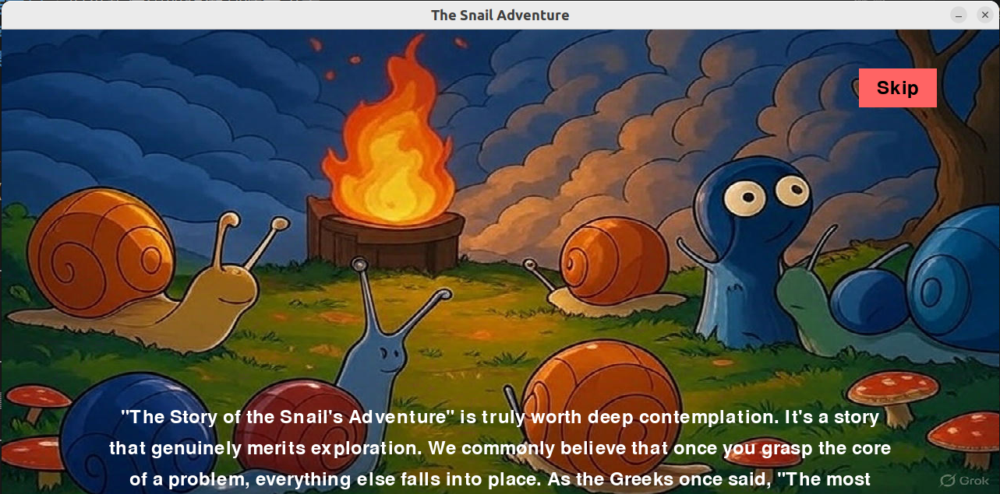
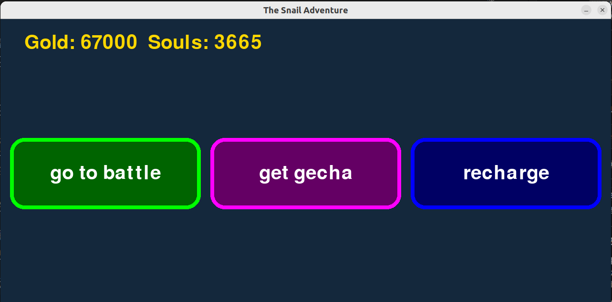
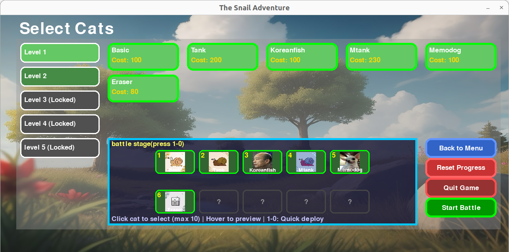
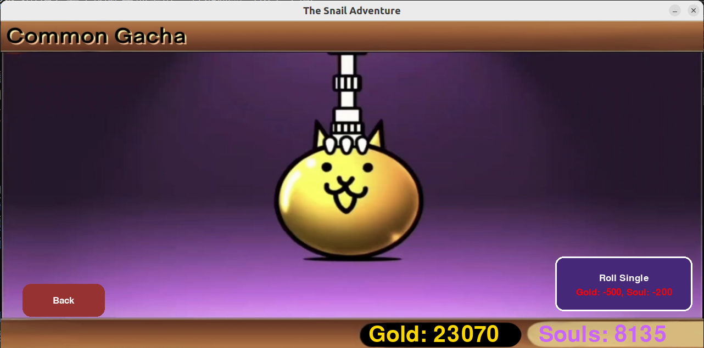
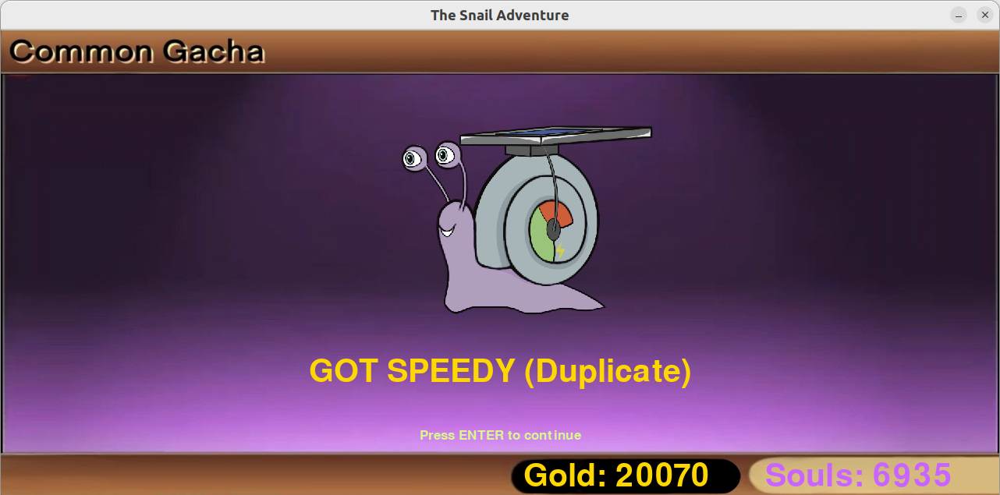
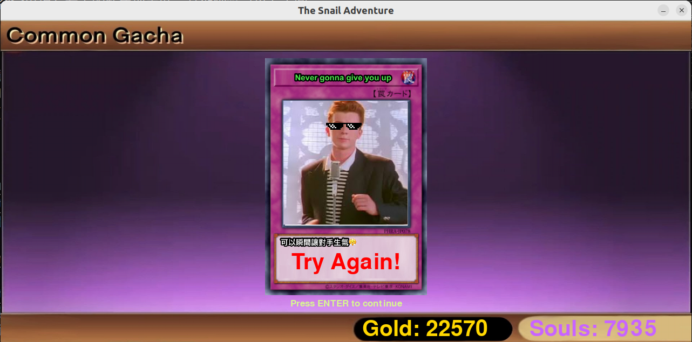
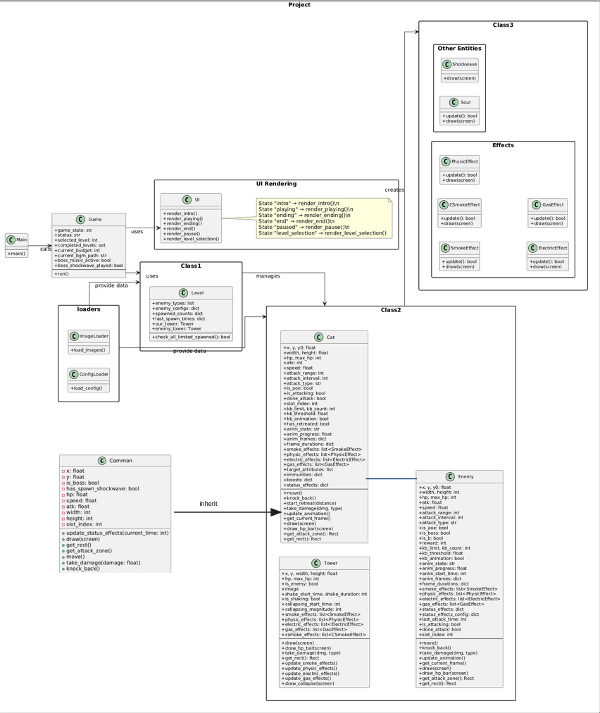
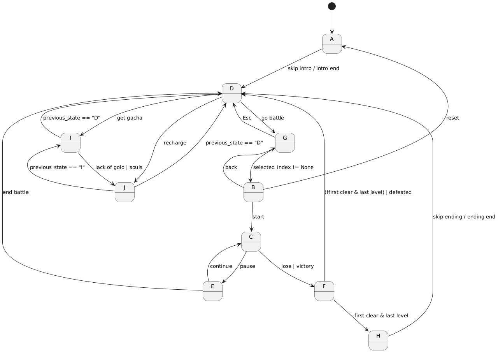

# aoop_2025_group7_TBC
aoop-2025-proj repo

本專案為 AOOP-2025 課程專案。以下是專案的目錄結構概覽以及主要檔案和資料夾的用途說明。

## 專案結構
aoop_2025_group7_TBC/

├── main.py              # 舊版程式入口

├── main_v2.py           # 應用程式入口點，初始化並啟動遊戲（呼叫 game/game_loop.py 主要迴圈）

├── README.md            # 專案說明文件

├── completed_levels.json # 舊版/額外的通關紀錄（部分流程可能仍會讀取）

├── game/                # 遊戲主程式（Python package）

│   ├── __init__.py      # 標記為 Python 套件

│   ├── game_loop.py     # （State Machine, 10 states）

│   ├── game_loop_old.py # 舊版遊戲迴圈備份

│   ├── battle_logic.py  # 戰鬥核心邏輯（敵人生成、碰撞/傷害等更新）

│   ├── config_loader.py # 讀取並解析配置（角色/敵人/關卡等資料）

│   ├── constants.py     # 全域常數與共用資源（圖片/音效載入、路徑、Gacha cost 等）

│   ├── load_images.py   # 圖片載入工具（序列幀、縮放、alpha 等）

│   ├── map_data.py      # 地圖/關卡節點資料（關卡選擇地圖用）

│   ├── rewards.py       # 獎勵/掉落/首通等規則資料

│   ├── gacha_manager.py # 轉蛋邏輯（抽取、資料更新等）

│   ├── gachaanimationplayer.py # 轉蛋動畫播放器（讀取 frame_paths 並播放）

│   ├── rechargemodal.py # 儲值/購買彈窗（信用卡輸入、成功提示等）

│   ├── uix.py           # 舊UI函數存放區

│   ├── game_charactor.py # 角色相關整合/舊檔（命名與實際用途以內容為準）

│   ├── gameLoop/        # 分離出的遊戲狀態處理（模組化中的實驗/重構）

│   │   └── playing_handler.py # playing 狀態處理器（分拆 game_loop 的嘗試）

│   ├── ui/              # 各狀態 UI 畫面與選單

│   │   ├── __init__.py

│   │   ├── intro.py             # 開場/故事畫面

│   │   ├── map_menu.py          # 地圖主選單相關 UI

│   │   ├── map_level.py         # 地圖/節點顯示

│   │   ├── level_selection.py   # 關卡選擇 UI（或舊版）

│   │   ├── battle_menu.py       # 關卡地圖選擇（draw_battle_map_selection）

│   │   ├── game_ui.py           # 戰鬥中 UI（按鈕、錢包、冷卻、鏡頭等）

│   │   ├── pause_menu.py        # 暫停選單

│   │   ├── end_screen.py        # 結算畫面（勝敗）

│   │   ├── ending_animation.py  # 結尾動畫

│   │   ├── gacha_ui.py          # 轉蛋 UI（roll、顯示結果、淡入淡出）

│   │   └── recharge_screen.py   # 儲值畫面 UI

│   └── entities/        # 遊戲實體（角色、敵人、關卡、特效、技能等）

│       ├── __init__.py

│       ├── common.py            # 共用基底/工具（數值、碰撞等）

│       ├── cat.py               # 我方角色（貓）行為/動畫/戰鬥

│       ├── cat_data.py          # 貓咪類型與屬性資料

│       ├── enemy.py             # 敵人行為/動畫/戰鬥

│       ├── enemy_data.py        # 敵人屬性資料

│       ├── enemyspawner.py      # 敵人生成器（依關卡/策略生成）

│       ├── spawnstrategies.py   # 生成策略（不同生成規則）

│       ├── level.py             # Level 類別（背景、塔、生成參數等）

│       ├── level_data.py        # 關卡配置資料

│       ├── tower.py             # 我方/敵方塔（血量、位置等）

│       ├── ymanager.py          # 出擊 y 軸管理（slot/占位）

│       ├── soul.py              # 靈魂/資源實體

│       ├── cannonskill.py       # 砲擊技能（beam/sweep/after FX 等）

│       ├── cannonicon.py        # 砲擊技能 icon（mask 點擊判定、冷卻注水效果）

│       ├── smokeeffect.py       # 煙霧特效

│       ├── csmokeeffect.py      # 兩組煙霧特效（雙面/雙點）

│       ├── shockwaveeffect.py   # 衝擊波特效

│       ├── electriceffect.py    # 電擊特效

│       ├── gaseffect.py         # 毒氣特效

│       └── physiceffect.py      # 物理/打擊特效

├── data/                # 玩家存檔/資源資料（JSON）

│   ├── player_resources.json        # 金幣/靈魂等資源

│   └── player_unlocked_cats.json    # 已解鎖角色

├── images/              # 遊戲圖片資源（背景、角色、特效、UI 等）

├── audio/               # 音效/背景音樂資源

├── cat_folder/          # 角色動畫素材與設定

├── enemy_folder/        # 敵人動畫素材與設定

├── level_folder/        # 關卡設定資料

├── intro/               # README 示意圖、開場相關素材（非必然由程式讀取）

├── video2img/           # 影片轉圖片工具（OpenCV 拆幀）

│   └── video2img.py

├── test_TBC.py          # 測試/實驗腳本

├── wasm_server.py       # wasm/網頁部署輔助（如有使用）

└── build/               # build 產物（可忽略或由工具生成）

## 功能特性
- **開場動畫**：從下往上滑動的故事介紹，可點擊 "Skip" 跳過。
- **關卡選擇**：選擇可玩關卡並組建貓咪隊伍（最多 10 隻）。
- **戰鬥系統**：實時部署貓咪，管理預算和冷卻時間，與敵人戰鬥。
- **暫停與結束**：提供暫停選單和遊戲結束畫面。
- **進度保存**：通關關卡後保存到 `completed_levels.json`。
- **視覺效果**：包含煙霧、衝擊波和靈魂收集。
- **關卡地圖（Battle Map）**：可用 WASD/方向鍵控制玩家指示物移動，滑鼠/靠近節點可高亮顯示並預覽關卡資訊。
- **獎勵預覽面板（Reward Preview Panel）**：在關卡地圖中，滑鼠懸浮或靠近節點時，右側面板即時顯示該關卡的可重複獎勵、首通獎勵與限時通關獎勵，並標示是否已領取。
- **轉蛋系統（Gacha）**：包含轉蛋 UI 與動畫播放。
- **儲值系統（Recharge）**：提供儲值介面/彈窗，支援信用卡輸入，並在成功後顯示提示訊息。
- **砲擊技能（Cannon Skill）**：包含 Skill Icon與技能特效（光束/掃射/爆炸後特效）等視覺表現。
- **音效與背景音樂**：按鈕/出擊等操作會播放對應音效；切換到戰鬥時會停止選單音樂並播放關卡背景音樂。

## 玩法:
- **開場**
執行main.py後, 會出現開場畫面, 你可以點擊skip, 或是看完整個~~很唬爛的~~介紹

- **主選單**
可用滑鼠點擊go to battle, get gacha（轉蛋系統）, recharge（氪金系統）

- **關卡地圖**
主選單滑鼠點擊go to battle後會被引導至這個頁面。左上角有操作說明。畫面中的節點代表每個關卡，灰色代表未解鎖，淺綠代表已通關，深綠代表已解鎖但未通關。關卡會先鎖住level 2以後的關卡, 確保你有能力通過比較前面簡單的關卡 ~~（可能後面比較簡單, 反正原版遊戲有這個案例）~~, 通過level 1可以玩level 2, 以此類推。將滑鼠游標或綠色透明點懸浮在節點上，就可以在右側藍色透明板上看到這個關卡的獎勵資訊。使用WASD或方向鍵控制綠色透明點懸浮在要遊玩的關卡，再按ENTER鍵就可以進入貓咪選擇界面。

- **貓咪（角色）選擇**
關卡地圖按ENTER後會被引導至這個頁面。左側有關卡狀態。可以用滑鼠懸浮在右上方塊查看角色圖片，鼠標點擊方塊即可部署，部署陣容會出現在右下的藍色部署區。其他細節可以看下圖。

- **戰鬥**
角色選擇按"Start Battle"後會被引導至這個頁面。可以用方向鍵左右捲動頁面。下方區塊有可使用角色，點選鍵盤對應數字或直接點擊方塊出擊。左下有錢包升級，可以消耗預算升級錢包。 右下有貓咪砲，可以在其顯示"Ready!"時點擊使用。另外可以按暫停鍵暫停遊戲。其他細節可以看下圖。

- **輸贏**
若敵方塔血=0時, 代表我方勝利，螢幕下方黃色區域會顯示通關獎勵，可以按ENTER確認；反之, 就是敵方勝利，一樣按Enter繼續。


- **轉蛋系統**
點擊右下角"Roll Single進行一次轉蛋"。必須消耗一定Gold和Souls（按鈕上有寫），若不足則自動導引至儲值界面。

中獎（重複）結果

中獎（新）結果

共歸結果

- **儲值系統**
滑鼠點擊選擇左側方案輸入信用卡card number儲值。


## 需求與安裝
### 必要依賴
- Python 3.8 或更高版本
- Pygame 2.0 或更高版本

### 安裝步驟
1. clone專案到本地：
   ```bash
   git clone git@github.com:unknown899/aoop_2025_group7_TBC.git
   cd aoop_2025_group7_TBC
2. 設定虛擬環境（如果有意保持整潔，可省略）
    ```bash
    python -m venv venv
    source venv/bin/activate  # Linux/Mac
    venv\Scripts\activate     # Windows
3. 安裝pygame
    ```bash
    pip install pygame
4. 執行main_v2.py(注意：不是main.py)
    ```bash
    python3 main_v2.py
## class diagram(簡化)



## finite state graph(不包含"quit")


Finite State Machine of the game. 
State A represents Intro; B represents Cat Selection; 
C represents Playing; D represents Main Menu; 
E represents Paused; F represents End; 
G represents Level Map; H represents Ending; 
I represents Gacha; and J represents Recharge.
